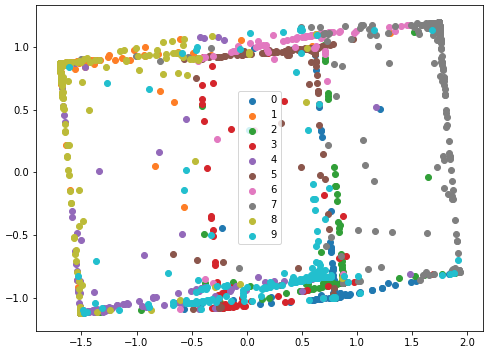
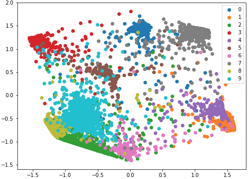
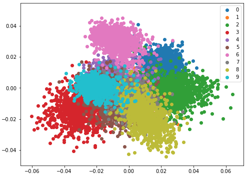
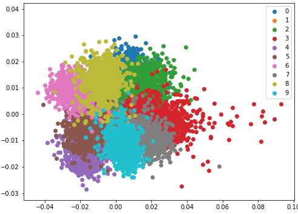

# Large-Margin-in-TensorFlow2

## 목적

[Large Margin Deep Networks for Classification](https://arxiv.org/abs/1803.05598) 에서 제안한 loss 성능 확인용 노트북

## 방법
* MNIST 데이터 사용
* CNN + Fully connected 로 이루어진 classification 모델
* large margin loss 구현
  * 최종 softmax 에만 적용
  * hidden layer에는 loss 적용 안함

## 시각화
* 최종 레이어 바로 이전 레이어의 latent를 시각화

**그냥 cross entropy  로스 씀**

**l2 로스 씀**

**large margin loss 적용**

**margin 좀 더 크게**

## TO DO
* <del>minimum distance 인  값을 키우면 더 분리 잘 될 수 있음</del> -> 꼭 그렇진 않다. 그래서 논문 저자들도 hyper parameter searching 을 함
* 더 빠르게 동작하도록 구현 (지금은 구현 잘해놔서 느림..)
  * 예를 들어, aggregateion operation 을 max만 하거나, top-k만 하도록
* hidden layer 에도 loss 적용
